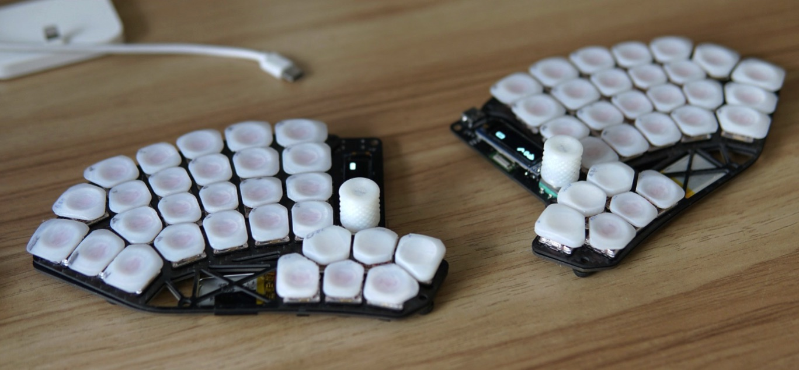
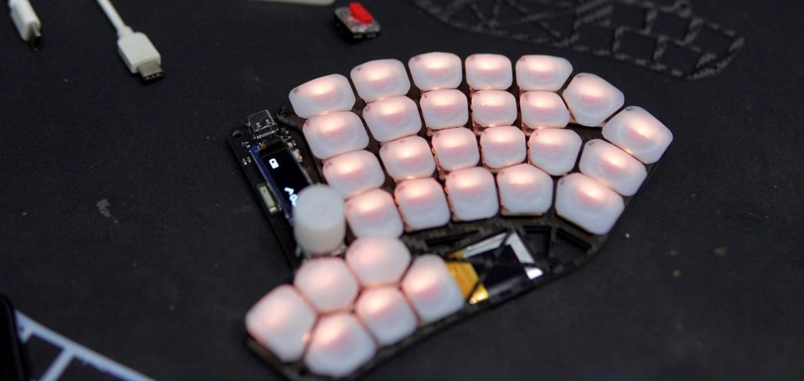
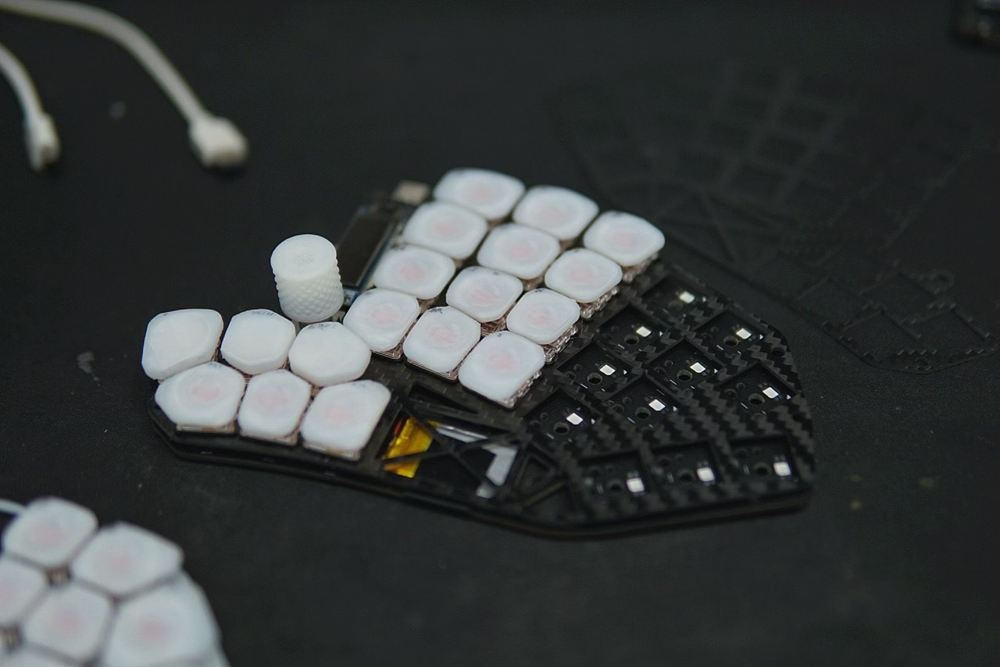

# TiBoard
>  TiBoard的硬件部分及说明文件

- merged SofleKeyboard and nrfBoard
- reserved place for trackpoint
- position of keys moved to my hand measurements
- carbon fiber top plate
- Voronoi style 3D print keycap

打包的KiCAD如果有什么问题麻烦发issue。

## 许可

可以自己随便做着玩。

空板交易无所谓，不要闲鱼卖套件，不要卖成品。

转载和修改版请带上我的名字。

## 需要注意购买的零件

**注意：为单套，左右手两只的数量需要x2 ！**

| 项目                 | 备注                                                         | 数量（单个板） | 链接                                                         |
| -------------------- | ------------------------------------------------------------ | -------------- | ------------------------------------------------------------ |
| E73蓝牙模块（PCB内） | E73-2G4M08S1C                                                | 1              | https://m.tb.cn/h.UL6DjRC  亿佰特nRF52840/52833芯片无线蓝牙MESH模块BLE4.2/5.0陶瓷天线 |
| 锂电池               | 402030（长30宽20厚4）不一定非要这家店，同尺寸带保护板即可。  | 1              | https://m.tb.cn/h.Upcs7Os  伯朗 导航行车记录仪锂电池大容量通用3.7v聚合物 |
| 轴体                 | 必须凯华1350型号，颜色任选                                   | 30             | https://m.tb.cn/h.UK0Awu7  凯华Kailh 1350巧克力机械键盘轴体按键猪鼻子矮轴红茶白粉紫轴 ，到【Tao宝】把我带回家 |
| 轴体热插拔底座       | 必须凯华1350型号                                             | 30             | https://item.taobao.com/item.htm?id=667154671807             |
| 定位板               | 厚度1.2mm，dxf文件见附件，参考价格碳纤维RMB68两片。也可以使用玻纤等其他不导电材料。 | 1              | https://item.taobao.com/item.htm?id=40340403528              |

## 状态及已知问题

BOM里充电电流设定用的R9 现在用的是2.2K，二极管是1N4148WS。

有其他疑问也请发issue。

已知问题：

- 目前使用的电池功耗大约1至2天，建议随时充电。
- 键位比较少 符号和其他按键不大方便。
- reset按钮位置比较难按。
- USB Type-C接口没有做沉板，左手的接口比较靠近桌子。
- 电池接插件比较大，目前直接焊线。
- I2C的两个电阻实测可以不焊接。
- 烧录E73模块真的很麻烦，需要先刷ST-LINK的固件 或者用STM32
- 指点杆的安装比较麻烦，而且可能影响厚度，兼容性还未测试。

## 链接

固件 https://github.com/tinyboxxx/zmk-config

固件下载 https://github.com/tinyboxxx/zmk-config/actions

键位编辑器 [ZMK Keymap Editor (nickcoutsos.github.io)](https://nickcoutsos.github.io/keymap-editor/)

视频 https://www.bilibili.com/video/BV1qe4y1t7zE/

烧录bootloader https://github.com/joric/nrfmicro/wiki/Bootloader#nrf52840

